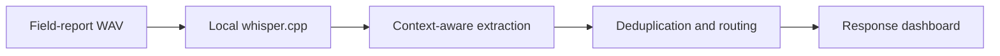

# ReliefRelay

Local, Arm-ready voice intelligence for emergency field reports.

ReliefRelay turns noisy radio-style WAV recordings into structured, prioritized
incident records without sending operational audio to an external AI API. It
combines a local `whisper.cpp` runtime, deterministic incident extraction,
context-aware location recovery, deduplication, and a response-operations
dashboard.

Built for the **Arm Create: AI Optimization Challenge**.

## Why it matters

Emergency teams often work with unreliable connectivity, constrained compute,
and degraded voice reports. ReliefRelay is designed to run locally on CPU-only
Arm64 infrastructure while preserving the information responders need:

- location and incident type;
- severity and number of people affected;
- requested resources;
- duplicate-report consolidation; and
- measured transcription latency and real-time factor.



## Current evidence

The included benchmark contains three synthetic emergency scenarios, three
voices, and three signal conditions: clear, radio, and severe.

| AMD64 local baseline | Result |
| --- | ---: |
| Fixtures | 9 |
| Mean inference time | 0.548 s |
| Mean real-time factor | 0.06x |
| Mean word error rate | 10.54% |
| Structured-field accuracy | 100% |

These numbers are a development-machine baseline, not Arm64 results. The
`Arm64 validation` GitHub Action provisions the same pinned runtime and emits a
native Arm64 benchmark artifact for an honest comparison.

## Quick start

Prerequisites:

- Python 3.12
- [uv](https://docs.astral.sh/uv/)

Install the locked dependencies:

```bash
uv sync --locked --dev
```

Download and verify the pinned `whisper.cpp` v1.9.2 CPU runtime and quantized
Tiny English model:

```bash
uv run python scripts/setup_whisper_runtime.py
```

The setup script supports Windows x64, Ubuntu x64, and Ubuntu Arm64. Downloaded
runtime files and models remain git-ignored.

Start the application:

```bash
uv run uvicorn reliefrelay.api:app --app-dir src --host 0.0.0.0 --port 8000
```

Open `http://127.0.0.1:8000`, select a scenario and signal condition, then click
**Transcribe + Route Report**.

## Validate

Run the tests:

```bash
uv run pytest -q -p no:cacheprovider
```

Run the complete audio benchmark:

```bash
uv run python scripts/benchmark_audio.py --output artifacts/whisper-benchmark.json
```

The output records architecture, processor, model, per-fixture transcript,
word error rate, inference time, real-time factor, and structured-field
accuracy.

To require a native Arm64 environment:

```bash
uv run python scripts/runtime_probe.py --require-arm64 --output artifacts/arm64-runtime.json
```

## Runtime configuration

The setup script installs the default local paths automatically. They can be
overridden for a VM, container, or custom build:

| Variable | Purpose |
| --- | --- |
| `RELIEFRELAY_WHISPER_BINARY` | Path to `whisper-cli` |
| `RELIEFRELAY_WHISPER_MODEL` | Path to a compatible GGML model |
| `RELIEFRELAY_WHISPER_THREADS` | CPU inference thread count; default `4` |

## Audio fixtures

The nine WAV files under `src/reliefrelay/static/audio/` are synthetic and do
not depict real events or people. Their exact transcripts, expected incident
fields, processing profiles, SHA-256 hashes, and provenance are recorded in
[`manifest.json`](src/reliefrelay/static/audio/manifest.json).

The voices were generated with the Apache-2.0-licensed Kokoro-82M model through
the MIT-licensed `kokoro-onnx` runner. Radio degradation is generated locally
and deterministically by `reliefrelay.audio_fixtures`.

## Project structure

```text
src/reliefrelay/            API, inference adapter, extraction and dashboard
src/reliefrelay/static/     Browser UI and benchmark WAV fixtures
scripts/                    Runtime setup, fixture generation and benchmarks
tests/                      Unit, API, fixture and pipeline validation
.github/workflows/          Native Arm64 CI evidence
```

## Scope

ReliefRelay is a hackathon prototype and decision-support tool. It does not
replace emergency dispatch procedures or human review. The known-location
resolver is deliberately scoped to the configured response district.

## License

Licensed under the Apache License 2.0. See [`LICENSE`](LICENSE).
