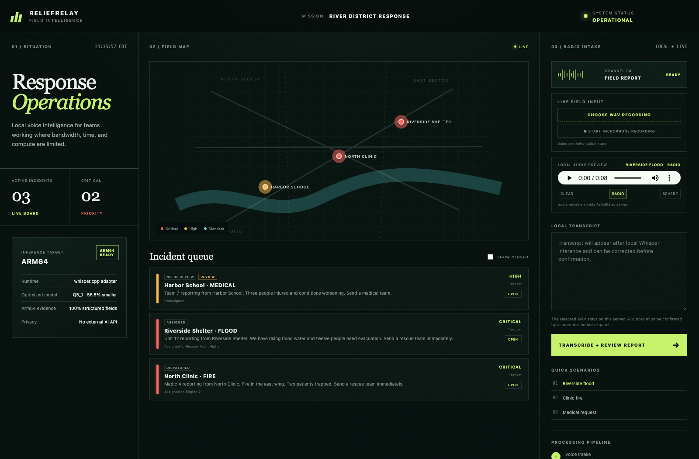
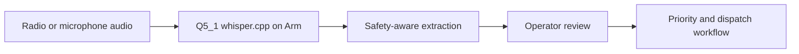

# ReliefRelay

Local, Arm-ready voice intelligence and human-reviewed incident operations for
emergency field reports.

ReliefRelay turns noisy radio-style WAV recordings into structured, prioritized
incident records without sending operational audio to an external AI API. It
combines a local `whisper.cpp` runtime, deterministic incident extraction,
context-aware location recovery, bounded deduplication, persistent report
history, operator review, and a response-operations dashboard.

Built for the **Arm Create: AI Optimization Challenge — Physical AI track**.
ReliefRelay consumes audio sensor input on nearby Arm edge compute and produces
human-reviewed priority and dispatch decisions without a cloud AI dependency.

> **Judges:** start with the [two-minute evaluation guide](docs/JUDGING.md),
> inspect the [native Arm64 evidence](docs/benchmarks/arm64-comparison.md), or
> use the [three-minute demo script](docs/DEMO_SCRIPT.md).



## Why it matters

Emergency teams often work with unreliable connectivity, constrained compute,
and degraded voice reports. ReliefRelay is designed to run locally on CPU-only
Arm64 infrastructure while preserving the information responders need:

- location and incident type;
- severity and number of people affected;
- requested resources;
- duplicate-report consolidation; and
- measured transcription latency and real-time factor.



## What was optimized for Arm

ReliefRelay's optimization is a reproducible stack rather than an architecture
label:

1. Pin and checksum-verify `whisper.cpp` v1.9.2 and Whisper Tiny English.
2. Generate a Q5_1 model from the verified full-precision model on Arm64.
3. Use the native Arm CPU backend and platform acceleration while bounding
   inference parallelism for stable tail latency.
4. Keep extraction, review, persistence, and routing local so audio never needs
   an external inference service.
5. Fail CI when provenance, environment parity, absolute quality, field
   accuracy, model-size reduction, or latency limits are violated.

The result is a **58.6% smaller model** with unchanged median latency, slightly
lower p95 latency, lower WER, and higher structured-field accuracy on the
included degraded-radio corpus.

## Native Arm64 evidence

The included benchmark contains three synthetic emergency scenarios, three
voices, and three signal conditions: clear, radio, and severe.

| Apple M4 Arm64, 6 threads | Full precision | Q5_1 | Change |
| --- | ---: | ---: | ---: |
| Model size | 74.10 MiB | 30.68 MiB | 58.60% smaller |
| Median inference | 0.273 s | 0.273 s | unchanged |
| P95 inference | 0.307 s | 0.302 s | 1.63% lower |
| Mean word error rate | 11.23% | 8.79% | 2.44 pp lower |
| Structured-field accuracy | 97.78% | 100.00% | 2.22 pp higher |

This comparison uses two warmups and seven runs for every fixture: **126 native
Arm64 inferences** total across the two models. Full reports, individual
timings, model hashes, runtime metadata, and quantization provenance are
committed under [`docs/benchmarks/`](docs/benchmarks/README.md). The same quality
guard also runs on a native `ubuntu-24.04-arm` GitHub Actions runner.

## Quick start

Prerequisites:

- Python 3.12
- [uv](https://docs.astral.sh/uv/)

Install the locked dependencies:

```bash
uv sync --locked --dev
```

Download and verify the pinned `whisper.cpp` v1.9.2 CPU runtime and quantized
Tiny English model:

```bash
uv run python scripts/setup_whisper_runtime.py
```

The setup script supports Windows x64, Ubuntu x64, Ubuntu Arm64, and macOS
Arm64/x64. macOS builds the pinned, checksum-verified source with CMake so the
native Metal-capable runtime matches the pinned version. Downloaded runtime
files and models remain git-ignored.

Start the application:

```bash
uv run uvicorn reliefrelay.api:app --app-dir src --host 0.0.0.0 --port 8000
```

Open `http://127.0.0.1:8000`, select a scenario and signal condition, then click
**Transcribe + Review Report**. You can also upload a WAV file or capture a
microphone recording directly in the browser. Confirm or correct every field
before acknowledging or assigning the incident.

Operational data is stored in `.local/reliefrelay.db` by default and survives
application restarts.

## Validate

Run the tests:

```bash
uv run pytest -q -p no:cacheprovider
```

Run the complete audio benchmark:

```bash
uv run python scripts/benchmark_audio.py --output artifacts/whisper-benchmark.json
```

The output records architecture, processor, model, per-fixture transcript,
word error rate, inference time, real-time factor, and structured-field
accuracy.

Reproduce the full-precision versus Q5_1 comparison locally:

```bash
uv run python scripts/setup_whisper_runtime.py \
  --comparison --metadata-output artifacts/quantization.json
uv run python scripts/benchmark_audio.py \
  --model models/whisper/ggml-tiny.en.bin --label full-precision \
  --runs 5 --warmups 1 --output artifacts/baseline.json
uv run python scripts/benchmark_audio.py \
  --model models/whisper/ggml-tiny.en-q5_1-reliefrelay.bin \
  --label q5_1-reliefrelay --runs 5 --warmups 1 \
  --output artifacts/optimized.json
uv run python scripts/compare_benchmarks.py \
  artifacts/baseline.json artifacts/optimized.json \
  --quantization artifacts/quantization.json \
  --json-output artifacts/comparison.json \
  --markdown-output artifacts/comparison.md
```

To require a native Arm64 environment:

```bash
uv run python scripts/runtime_probe.py --require-arm64 --output artifacts/arm64-runtime.json
```

## Runtime configuration

The setup script installs the default local paths automatically. They can be
overridden for a VM, container, or custom build:

| Variable | Purpose |
| --- | --- |
| `RELIEFRELAY_WHISPER_BINARY` | Path to `whisper-cli` |
| `RELIEFRELAY_WHISPER_MODEL` | Path to a compatible GGML model |
| `RELIEFRELAY_WHISPER_THREADS` | CPU inference threads; defaults to available CPUs capped at `6` |
| `RELIEFRELAY_WHISPER_TIMEOUT_SECONDS` | Maximum seconds for one transcription; default `120` |
| `RELIEFRELAY_DATABASE` | Persistent SQLite database path |
| `RELIEFRELAY_API_TOKEN` | Optional bearer token; set for shared deployments |
| `RELIEFRELAY_MAX_CONCURRENT_INFERENCE` | Maximum simultaneous Whisper jobs; default `1` |
| `RELIEFRELAY_QUEUE_TIMEOUT_SECONDS` | Maximum inference queue wait; default `5` |
| `RELIEFRELAY_DEDUPLICATION_WINDOW_HOURS` | Window for merging similar open reports; default `24` |

See [`.env.example`](.env.example) for the complete configuration and
[`docs/OPERATIONS.md`](docs/OPERATIONS.md) for deployment, backup, access, and
incident-workflow guidance.

## Audio fixtures

The nine WAV files under `src/reliefrelay/static/audio/` are synthetic and do
not depict real events or people. Their exact transcripts, expected incident
fields, processing profiles, SHA-256 hashes, and provenance are recorded in
[`manifest.json`](src/reliefrelay/static/audio/manifest.json).

The voices were generated with the Apache-2.0-licensed Kokoro-82M model through
the MIT-licensed `kokoro-onnx` runner. Radio degradation is generated locally
and deterministically by `reliefrelay.audio_fixtures`.

## Project structure

```text
src/reliefrelay/            API, inference adapter, extraction and dashboard
src/reliefrelay/static/     Browser UI and benchmark WAV fixtures
scripts/                    Runtime setup, fixture generation and benchmarks
tests/                      Unit, API, fixture and pipeline validation
.github/workflows/          Native Arm64 CI evidence
```

## Scope

ReliefRelay is a decision-support tool. It does not replace emergency dispatch
procedures. Machine-extracted incidents enter `needs_review`; original reports
and operator changes are retained in an audit history. The known-location
resolver remains deliberately scoped to the configured response district.

## License

Licensed under the Apache License 2.0. See [`LICENSE`](LICENSE).
