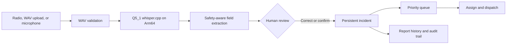
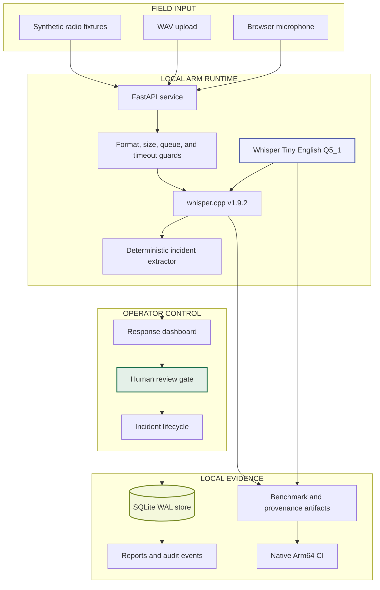
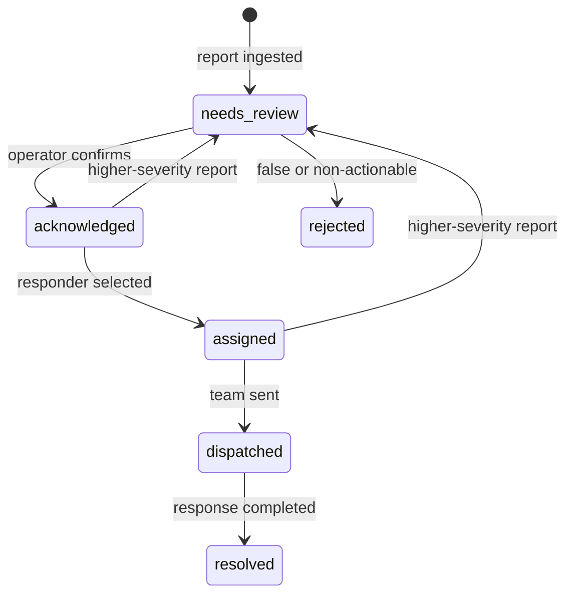

# ReliefRelay — From Broken Radio to Reviewed Response

[](https://www.python.org/)
[](https://fastapi.tiangolo.com/)
[](https://www.arm.com/)
[](https://github.com/ggml-org/whisper.cpp)
[](https://github.com/Sai-Krishna99/reliefrelay/actions/workflows/arm64-validate.yml)
[](#reproducible-testing)
[](LICENSE)

> **When connectivity and audio both fail, response intelligence should keep working.**

ReliefRelay turns noisy radio-style WAV recordings into structured, prioritized
incident records entirely on nearby Arm hardware. Local `whisper.cpp`
transcription feeds a safety-aware extractor, an operator reviews every AI
draft, and SQLite preserves the source report and every response decision.

The product is designed around one boundary: **AI may propose an incident, but
only a human operator may acknowledge, assign, dispatch, resolve, or reject
it.**

**Arm Create: AI Optimization Challenge track:** Physical AI<br>
**Inference:** local and cloud-independent<br>
**Demo data:** entirely synthetic


## Quick Highlights

- **Radio-to-response workflow** — microphone, upload, and bundled degraded-radio inputs become reviewed incidents
- **Local Arm inference** — operational audio is processed through `whisper.cpp` without an external AI API
- **58.6% smaller model** — Q5_1 reduces Whisper Tiny English from 74.10 MiB to 30.68 MiB
- **Measured, not implied** — raw transcripts, timings, hashes, environment data, WER, and task accuracy are committed
- **Human-owned decisions** — extracted fields remain editable and enter `needs_review` before operational action
- **Persistent incident history** — reports, corrections, assignments, status changes, and audit events survive restarts
- **Safety-aware extraction** — negation, number words, resource intent, numeric addresses, and unknown locations are handled explicitly
- **Bounded edge runtime** — concurrency limits, queue timeouts, transcription timeouts, and Arm-aware thread tuning protect the device
- **Reproducible Arm64 CI** — native Arm runners rebuild the quantized model, execute tests, benchmark both variants, and enforce quality gates

## Architecture Overview

### Physical-AI Response Loop



### System Architecture



### Incident Lifecycle



Resolved and rejected incidents never absorb later reports. A new report may
return an open incident to review when it raises the known severity, but it may
not silently lower the highest recorded severity.

## The Problem

Emergency field reports arrive under hostile conditions: weak connectivity,
background noise, damaged radios, limited compute, and operators already under
pressure. A cloud speech endpoint introduces another dependency, while an
unreviewed transcript can create a false incident, merge unrelated reports, or
send the wrong resource.

The useful output is not text alone. Responders need a trustworthy operational
record containing:

- where the event is happening;
- what type of incident was reported;
- how severe it appears;
- how many people are affected;
- which resource was requested; and
- who reviewed, assigned, and changed the event.

## The Solution

ReliefRelay creates a local, reviewable response record:

1. An operator selects a bundled fixture, uploads a WAV, or records a microphone report.
2. The API validates the audio before allowing it into the inference queue.
3. A quantized Whisper model transcribes it through a pinned local `whisper.cpp` runtime.
4. Deterministic safeguards extract location, incident, severity, people, and requested resources.
5. The dashboard exposes the transcript, confidence, warnings, and every field for correction.
6. A human confirms the draft and controls acknowledgement, assignment, dispatch, and resolution.
7. SQLite retains the original report, processing metadata, corrections, and lifecycle audit events.

The result is an operational edge workflow rather than a transcription demo.

## Product Features

### Local Voice Intake

- Included clear, radio, and severe WAV scenarios
- Browser microphone capture and WAV upload
- 16-bit PCM, channel, sample-rate, empty-file, extension, and 25 MB validation
- Measured inference duration and real-time factor on every audio report
- Temporary upload cleanup after success or failure

### Safety-Aware Incident Extraction

- Context-aware matching against configured response locations
- Incident negation handling to reduce false alarms
- Compound number-word and numeric address parsing
- Resource extraction only when request intent is present
- Confidence, missing-field warnings, and mandatory review state
- Conservative fingerprints that do not merge unrelated unknown reports

### Human-Reviewed Operations

- Editable transcript and structured fields
- Severity-ranked incident queue
- Acknowledge, assign, dispatch, resolve, and reject actions
- Report-level source and processing history
- Operator identity and timestamped audit events
- Deduplication limited to similar open incidents inside a configurable window

### Edge Runtime Protection

- Optional bearer-token protection for operational API routes
- Constant-time token comparison
- Bounded concurrent inference and queue wait
- Per-transcription process timeout
- Arm-aware thread default capped at six for stable tail latency
- Content Security Policy and browser security headers
- One application worker per SQLite database for predictable local operation

## Arm Optimization Evidence

ReliefRelay does not treat “runs on Arm” as an optimization result. The
repository pins the runtime and model, generates the optimized artifact from a
verified baseline, measures both models under the same conditions, and fails
CI when provenance, quality, footprint, or latency boundaries are violated.


| Apple M4 Arm64, 6 threads | Full precision | Q5_1 | Change |
|---|---:|---:|---:|
| Model size | 74.10 MiB | 30.68 MiB | **58.60% smaller** |
| Median inference | 0.273 s | 0.273 s | unchanged |
| P95 inference | 0.307 s | 0.302 s | 1.63% lower |
| Mean word error rate | 11.23% | 8.79% | 2.44 pp lower |
| Structured-field accuracy | 97.78% | 100.00% | 2.22 pp higher |

The submitted comparison uses two warmups and seven measured runs for each of
nine fixtures under both models: **126 native Arm64 inferences**. The primary
optimization win is footprint. Quality improvements were observed on this
small deterministic corpus and are not presented as universal model gains.

The complete evidence bundle includes:

- safe runtime and hardware metadata;
- baseline and Q5_1 model hashes;
- quantization provenance and duration;
- every transcript and individual inference timing;
- aggregate latency, real-time factor, WER, and structured-field accuracy; and
- every quality-guard decision.

See [`docs/benchmarks/`](docs/benchmarks/README.md) for the raw evidence and
exact reproduction procedure.

## Judge Quick Start

No API key or cloud AI account is required. Requirements are Python 3.12+, Git,
CMake, and [`uv`](https://docs.astral.sh/uv/).

```bash
git clone https://github.com/Sai-Krishna99/reliefrelay.git
cd reliefrelay
uv sync --locked --dev
uv run python scripts/setup_whisper_runtime.py
uv run uvicorn reliefrelay.api:app --app-dir src --host 127.0.0.1 --port 8000
```

Open <http://127.0.0.1:8000> and follow this path:

1. Confirm the dashboard reports `OPERATIONAL` and displays the Arm architecture.
2. Select **Harbor School Medical** and the **Severe** signal condition.
3. Play the degraded audio, then select **Transcribe + Review Report**.
4. Inspect the measured inference time, transcript, confidence, and extracted fields.
5. Correct or confirm the AI draft, assign a response team, and acknowledge it.
6. Open the incident and inspect its original report and audit history.
7. Move it through assigned, dispatched, and resolved states.

The WAV and resulting operational data remain on the ReliefRelay host.

## Reproducible Testing

```bash
# Complete unit and API integration suite
uv run pytest -q -p no:cacheprovider

# Verify Python modules compile
uv run python -m compileall -q src scripts

# Validate browser JavaScript syntax
node --check src/reliefrelay/static/app.js

# Build source and wheel distributions
uv build

# Validate the container configuration
docker compose config --quiet
```

Current verified result:

```text
Tests       35 passed
Arm64 CI    passed on native ubuntu-24.04-arm
Package     source distribution and wheel built
Container   Compose configuration and non-root runtime verified
```

Coverage includes extraction negation, quantities, locations, resource intent,
deduplication, severity escalation, review corrections, incident state
transitions, report history, audit events, authentication, WAV validation,
queue overload, transcription failures, API behavior, benchmark parity, model
provenance, model footprint, latency, WER, and structured-field quality gates.

## Benchmark Reproduction

```bash
uv run python scripts/setup_whisper_runtime.py \
  --comparison --metadata-output artifacts/quantization.json

uv run python scripts/runtime_probe.py \
  --require-arm64 --output artifacts/runtime.json

uv run python scripts/benchmark_audio.py \
  --model models/whisper/ggml-tiny.en.bin \
  --label full-precision --threads 6 --runs 7 --warmups 2 \
  --output artifacts/baseline.json

uv run python scripts/benchmark_audio.py \
  --model models/whisper/ggml-tiny.en-q5_1-reliefrelay.bin \
  --label q5_1-reliefrelay --threads 6 --runs 7 --warmups 2 \
  --output artifacts/optimized.json

uv run python scripts/compare_benchmarks.py \
  artifacts/baseline.json artifacts/optimized.json \
  --quantization artifacts/quantization.json \
  --json-output artifacts/comparison.json \
  --markdown-output artifacts/comparison.md
```

The comparison exits non-zero if the two reports use mismatched environments,
model provenance is invalid, Q5_1 is not smaller, structured accuracy falls
below 95%, optimized WER exceeds 20%, WER regresses by more than two percentage
points, median latency regresses by more than 5%, or p95 regresses by more than
10%.

## Commands

| Command | Purpose |
|---|---|
| `uv sync --locked --dev` | Install the exact development dependency lock |
| `uv run python scripts/setup_whisper_runtime.py` | Provision the verified local Whisper runtime and Q5_1 model |
| `uv run uvicorn reliefrelay.api:app --app-dir src --port 8000` | Start the dashboard and API |
| `uv run pytest -q -p no:cacheprovider` | Run all automated tests |
| `uv run python scripts/benchmark_audio.py` | Benchmark local inference and task quality |
| `uv run python scripts/runtime_probe.py --require-arm64` | Validate and record an Arm64 runtime |
| `uv build` | Build the Python source and wheel distributions |
| `docker compose up --build -d` | Start the containerized single-node service |

## API Surface

```text
GET    /api/health
GET    /api/incidents?include_closed=true
GET    /api/incidents/{incident_id}
PATCH  /api/incidents/{incident_id}
POST   /api/reports/text
POST   /api/reports/audio
```

When `RELIEFRELAY_API_TOKEN` is configured, all operational `/api/*` routes
require `Authorization: Bearer <token>` except `/api/health`. Interactive API
documentation is available at `/docs` while the FastAPI service is running.

## Configuration

| Variable | Purpose | Default |
|---|---|---|
| `RELIEFRELAY_DATABASE` | SQLite operational database | `.local/reliefrelay.db` |
| `RELIEFRELAY_API_TOKEN` | Optional operator bearer token | unset |
| `RELIEFRELAY_WHISPER_BINARY` | Path to `whisper-cli` | auto-discovered |
| `RELIEFRELAY_WHISPER_MODEL` | Path to a compatible GGML model | local Q5_1 model |
| `RELIEFRELAY_WHISPER_THREADS` | Inference threads | available CPUs, capped at `6` |
| `RELIEFRELAY_WHISPER_TIMEOUT_SECONDS` | Maximum transcription duration | `120` seconds |
| `RELIEFRELAY_MAX_CONCURRENT_INFERENCE` | Simultaneous Whisper jobs | `1` |
| `RELIEFRELAY_QUEUE_TIMEOUT_SECONDS` | Maximum inference queue wait | `5` seconds |
| `RELIEFRELAY_DEDUPLICATION_WINDOW_HOURS` | Similar-open-report merge window | `24` hours |

See [`.env.example`](.env.example) for a copyable template and
[`docs/OPERATIONS.md`](docs/OPERATIONS.md) for backup, access, deployment, and
incident-workflow guidance.

## Container Deployment

The image runs as a non-root user and stores SQLite state in `/data`. Model and
runtime assets are intentionally not baked into the image; provision them on
the target Linux host and mount them through the included Compose file.

```bash
uv run python scripts/setup_whisper_runtime.py
docker compose up --build -d
docker compose logs -f reliefrelay
```

The default Compose port is loopback-only. Shared deployments should set a long
API token and place ReliefRelay behind TLS or a private gateway.

## Project Structure

```text
reliefrelay/
├── src/reliefrelay/             # API, domain model, extraction, store, and pipeline
│   └── static/                  # Dashboard and deterministic audio fixtures
├── scripts/                     # Runtime setup, fixture generation, and benchmarks
├── tests/                       # Unit, API, pipeline, store, and benchmark tests
├── docs/benchmarks/             # Committed native Arm64 evidence bundle
├── docs/images/                 # Dashboard and optimization proof images
├── docs/OPERATIONS.md           # Deployment and recovery guidance
├── .github/workflows/           # Native Arm64 validation workflow
├── Dockerfile
├── compose.yaml
├── pyproject.toml
└── .env.example
```

## Audio Fixture Provenance

The nine bundled WAVs are deterministic synthetic fixtures: three emergency
scenarios, three voices, and clear, radio, or severe signal profiles. They do
not depict real events or people.

Exact source sentences, expected fields, voice provenance, signal
transformations, processing parameters, and SHA-256 hashes are recorded in
[`manifest.json`](src/reliefrelay/static/audio/manifest.json). The voices were
generated with the Apache-2.0-licensed Kokoro-82M model through the MIT-licensed
`kokoro-onnx` runner.

## Safety and Operational Boundaries

- ReliefRelay is decision support, not an autonomous emergency dispatch system.
- Every machine-created incident starts in `needs_review`.
- The transcript and all extracted fields remain editable before acknowledgement.
- Original source reports are retained when operators make corrections.
- Open incidents may merge only within the configured time window and fingerprint.
- Resolved and rejected incidents never absorb later reports.
- The highest known severity cannot be silently reduced by a later report.
- Synthetic benchmark results do not establish population-level speech accuracy.
- Shared deployments require TLS, stronger organizational identity, retention rules, monitoring, and security review.
- The configured location resolver is deliberately limited to the response district.

## Why ReliefRelay Is Different

| Capability | Basic speech-to-text | Cloud incident pipeline | ReliefRelay |
|---|:---:|:---:|:---:|
| Works without a cloud inference API | ✅ | ❌ | ✅ |
| Produces structured incident fields | ❌ | ✅ | ✅ |
| Requires human review before action | ❌ | ⚠️ | ✅ |
| Preserves original reports and corrections | ❌ | ⚠️ | ✅ |
| Prevents closed-incident deduplication | ❌ | ⚠️ | ✅ |
| Includes reproducible model provenance | ❌ | ⚠️ | ✅ |
| Measures both speech and task accuracy | ❌ | ⚠️ | ✅ |
| Enforces optimization quality in native Arm64 CI | ❌ | ⚠️ | ✅ |

The novelty is the complete loop: **physical audio input + optimized local Arm
inference + safety-aware structuring + human authority + persistent response
history + reproducible proof.**

## Production Boundary

ReliefRelay is a working, end-to-end hackathon product intended for local or
single-node evaluation. Before a real emergency organization handles sensitive
reports, a deployment should add organizational identity and role-based access,
managed database backups, encryption and retention policy, observability,
multilingual field validation, abuse controls, disaster-recovery exercises, and
integration with an authorized dispatch or radio gateway.

This boundary is deliberate: the repository demonstrates a credible local
response workflow without claiming that synthetic evaluation equals field
certification.

## Future Enhancements

- Validate performance and energy use on Raspberry Pi 5 and Arm Neoverse systems
- Build a consented, multilingual and multi-accent field-radio corpus
- Add coordinate-aware geospatial resolution and map layers
- Integrate authorized radio gateways and outbound dispatch notifications
- Replace the shared token with organizational identity and role controls
- Migrate multi-node deployments from SQLite to PostgreSQL
- Add offline replication between disconnected response posts
- Measure energy per report alongside latency, quality, and model footprint

## Arm Create Submission

- **Track:** Physical AI
- **Platform:** native Arm64 edge compute
- **Core optimization:** Whisper Tiny English Q5_1 through pinned `whisper.cpp`
- **Repository:** <https://github.com/Sai-Krishna99/reliefrelay>
- **Evidence:** [`docs/benchmarks/`](docs/benchmarks/README.md)
- **License:** Apache-2.0

The public repository contains all source code, synthetic assets, setup
instructions, screenshots, raw benchmark reports, provenance, and native Arm64
validation required to reproduce the project.

## License

[Apache License 2.0](LICENSE)

---

**Built for the Arm Create: AI Optimization Challenge — Physical AI.**

*Hear the report. Recover the signal. Review the decision. Relay the response.*
