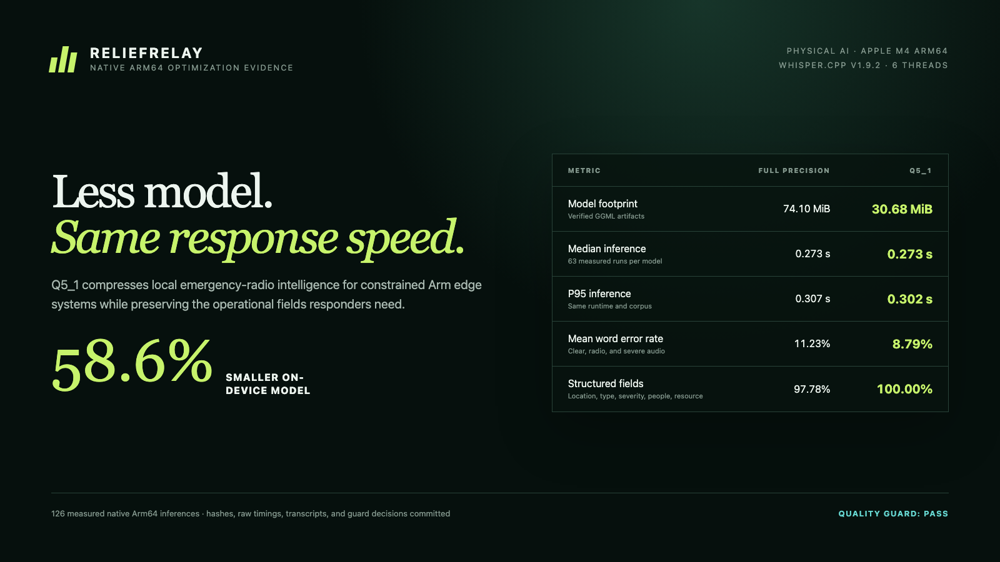

# Devpost submission copy

## Project name

ReliefRelay

## Tagline

Offline Arm AI that turns noisy emergency radio into reviewed, actionable
incident intelligence.

## Track

Physical AI

ReliefRelay consumes real or simulated audio sensor input on nearby Arm edge
compute and produces alert, priority, and dispatch decisions that affect a
physical response workflow.

## Project overview


Emergency teams cannot assume a perfect network, quiet audio, or unlimited
compute. ReliefRelay turns degraded radio-style recordings into structured,
prioritized incident records entirely on local Arm64 hardware. It identifies
location, incident type, severity, people affected, and requested resources,
then requires an operator to confirm or correct the AI draft before assignment
or dispatch.

ReliefRelay should win because it combines a compelling physical-AI use case
with reproducible Arm optimization evidence. It does not merely claim to run on
Arm: the repository includes model provenance, raw before/after transcripts,
126 measured native Arm64 inferences, task-level accuracy, strict quality
guards, and a native Linux Arm CI workflow. It also treats safety honestly by
preserving original reports and putting human review between inference and
action.

## Functionality and output

An operator can choose an included radio fixture, upload a WAV, or record from
the browser microphone. ReliefRelay then:

1. transcribes locally using Q5_1 Whisper Tiny English and `whisper.cpp`;
2. extracts incident fields with negation and context safeguards;
3. attaches confidence and review warnings;
4. presents an editable draft to the operator;
5. acknowledges, assigns, dispatches, resolves, or rejects the incident; and
6. preserves every report, review, correction, and audit event in SQLite.

The result is a local response-operations dashboard and a reusable Arm64 voice
optimization toolkit: verified runtime provisioning, deterministic degraded
audio fixtures, benchmarking, quality comparison, and native Arm CI.

## Arm optimization

The full-precision 74.10 MiB model is generated into a 30.68 MiB Q5_1 model on
Arm64—a 58.6% footprint reduction. On an Apple M4 Arm64 device with six
inference threads, two warmups and seven runs for each of nine fixtures:



- median inference remained 0.273 seconds;
- p95 improved from 0.307 to 0.302 seconds;
- WER changed from 11.23% to 8.79% on the submitted corpus; and
- structured-field accuracy changed from 97.78% to 100%.

The model is generated from a SHA-256-verified baseline using a pinned
`whisper.cpp` v1.9.2 quantizer. A comparison guard rejects mismatched
environments, invalid provenance, unacceptable absolute or relative accuracy,
insufficient size reduction, and latency regression. Raw JSON evidence is
committed in the public repository.

The system also avoids a network inference round trip and keeps operational
audio local. Inference concurrency and thread count are bounded for predictable
behavior on constrained edge systems.

## How it was built

- Python 3.12+, FastAPI, Uvicorn, and SQLite
- `whisper.cpp` v1.9.2 with Whisper Tiny English Q5_1
- Native Arm64 runtime provisioning for Ubuntu and macOS
- Plain HTML, CSS, and JavaScript for a dependency-light local dashboard
- Deterministic Kokoro-generated test voices and locally generated radio noise
- Pytest, native Arm GitHub Actions, Docker, and Compose

## Challenges

Noisy speech creates failures beyond transcription errors: a damaged location
can merge the wrong event, a negated phrase can create a false alarm, and a
later update can erase critical evidence. The first prototype exposed exactly
those risks. ReliefRelay now recognizes negated incident terms, parses compound
number words and numeric addresses, requires request intent for ambiguous
resources, prevents unknown reports from collapsing into one fingerprint,
never silently lowers the highest known severity, and records report-level
review identity and time.

The second challenge was proving optimization fairly. Both models now use the
same pinned runtime, device, threads, corpus, warmups, and run counts. The
comparison reports tradeoffs instead of hiding them: the win is primarily model
footprint and retained task quality, not an invented latency claim.

## Accomplishments

- 58.6% model-size reduction with flat median latency.
- 100% structured-field accuracy on all nine submitted signal conditions.
- Real microphone and upload intake with local inference.
- Persistent incident lifecycle, source report history, human review, and
  auditable operator actions.
- Reproducible native Arm64 evidence and CI quality enforcement.
- 35 passing automated tests plus a verified non-root container deployment.

## What we learned

Optimizing a safety-sensitive physical-AI product is not only a model exercise.
The best system boundary combines a small local model, deterministic recovery,
visible uncertainty, and a human decision point. Task-level field accuracy can
also be more meaningful than WER alone: transcription differences matter only
insofar as they change operational decisions.

## What's next

- Validate on Raspberry Pi 5 and an Arm Neoverse edge server.
- Build a consented, multilingual field-radio evaluation corpus.
- Add coordinate-aware geospatial resolution and radio gateway ingestion.
- Measure energy per report on target edge hardware.
- Replace shared-token access with organizational identity and role controls.

## Setup and validation

```bash
git clone https://github.com/Sai-Krishna99/reliefrelay.git
cd reliefrelay
uv sync --locked --dev
uv run python scripts/setup_whisper_runtime.py
uv run uvicorn reliefrelay.api:app --app-dir src --host 127.0.0.1 --port 8000
```

Open `http://127.0.0.1:8000`.

Tests:

```bash
uv run pytest -q -p no:cacheprovider
```

The exact native Arm64 benchmark reproduction commands are in
[`docs/benchmarks/README.md`](benchmarks/README.md).

## Safety and data disclosure

ReliefRelay is decision support and does not replace emergency dispatch
procedures. All included voices and events are synthetic. No operational audio
is sent to an external AI API. Third-party model/runtime provenance and hashes
are documented, and the project is licensed under Apache 2.0.
